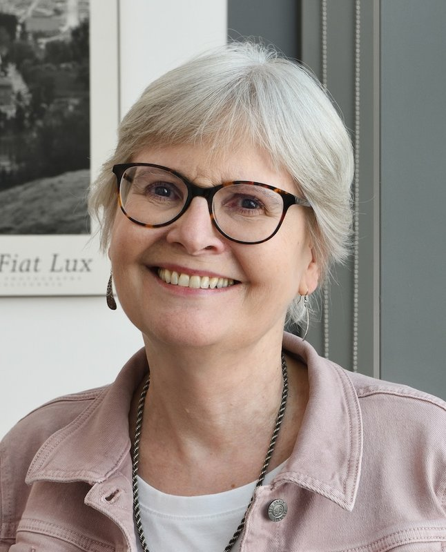
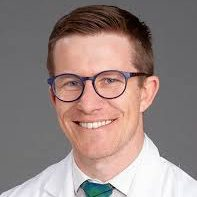
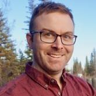
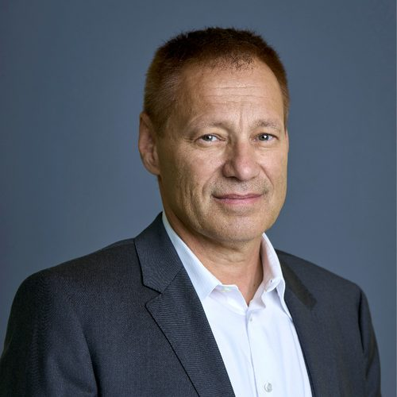
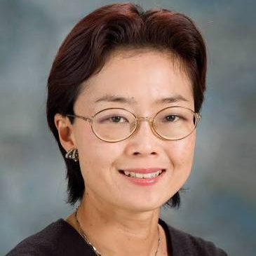
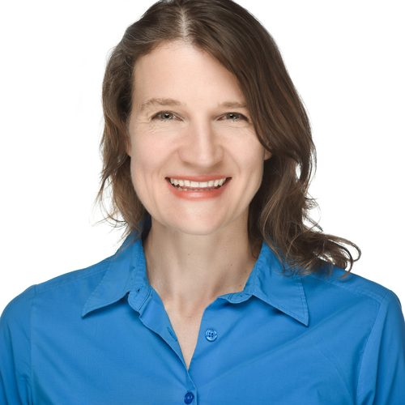
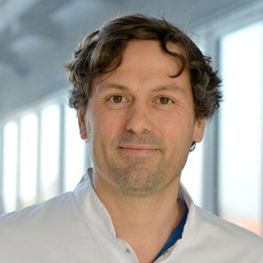

## Organizing committee

::: {.people-grid}

::: {.person-card}
### Joel Zindel

Co-organizer

ETH Zürich · Institute of Molecular Health Sciences

:::

::: {.person-card}
### Inge K. Herrmann

Co-organizer

ETH Zürich / Empa · Particles–Biology Interactions

:::

::: {.person-card}
### Erin Greaves

Co-organizer

Warwick Medical School · Endometriosis

:::

::: {.person-card}
### Sarah Herrick

Co-organizer

University of Manchester · MMT & Peritoneal Dialysis

:::

:::

## Confirmed speakers

The full keynote line-up for 2027 is being assembled. The following speakers have confirmed their participation so far:

::: {.people-grid}

::: {.person-card}
<!-- {.person-photo} -->
### Judith Allen

Confirmed speaker

University of Manchester

:::

::: {.person-card}
<!-- {.person-photo} -->
### Samuel Carmichael II

Confirmed speaker

Wake Forest School of Medicine

:::

::: {.person-card}
<!-- {.person-photo} -->
### Justin Deniset

Confirmed speaker

University of Calgary

:::

::: {.person-card}
<!-- {.person-photo} -->
### Paul Kubes

Confirmed speaker

University of Calgary · Snyder Institute for Chronic Diseases

:::

::: {.person-card}
<!-- {.person-photo} -->
### Honami Naora

Confirmed speaker

MD Anderson Cancer Center · Department of Molecular Oncology

:::

::: {.person-card}
<!-- {.person-photo} -->
### Gwendalyn J. Randolph

Confirmed speaker

Washington University in St. Louis

:::

::: {.person-card}
<!-- {.person-photo} -->
### Carl Weidinger

Confirmed speaker

Charité — Universitätsmedizin Berlin

:::

:::

More speakers will be added as confirmations come in.

## Endorsements from the 1st Summit

> *"The programme looks very exciting!"* — Erin Greaves
>
> *"The peritoneal cancer and endometriosis session sounds amazing to me!"* — Nan Zhang
>
> *"While I study peritoneal macrophages, the impact of peritoneal cells could be so broad."* — Paul Kubes
