## Confirmed speakers

The full keynote line-up for 2027 is being assembled. The following speakers have confirmed their participation so far:

::: {.people-grid}

::: {.person-card}
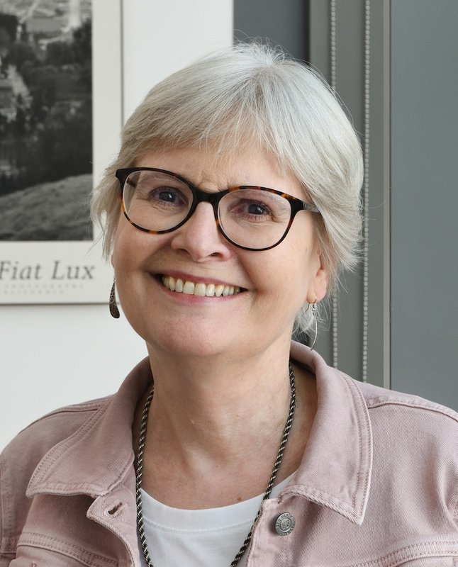{.person-photo}

### Judith Allen

Confirmed speaker

University of Manchester

:::

::: {.person-card}
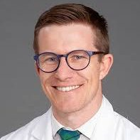{.person-photo}

### Samuel Carmichael II

Confirmed speaker

Wake Forest School of Medicine

:::

::: {.person-card}
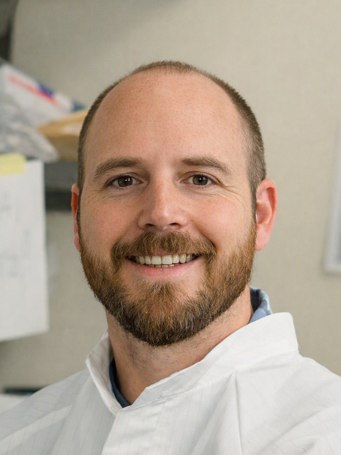{.person-photo}

### Luke Davies

Confirmed speaker

Swansea University Medical School · Immunometabolism

:::

::: {.person-card}
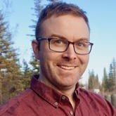{.person-photo}

### Justin Deniset

Confirmed speaker

University of Calgary

:::

::: {.person-card}
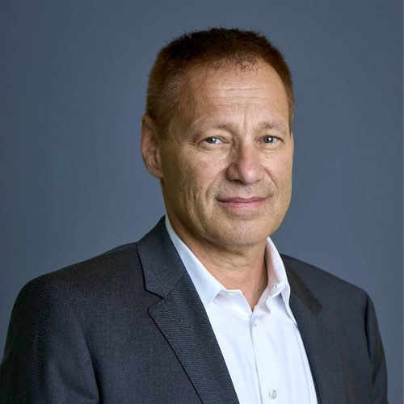{.person-photo}

### Paul Kubes

Confirmed speaker

University of Calgary · Snyder Institute for Chronic Diseases

:::

::: {.person-card}
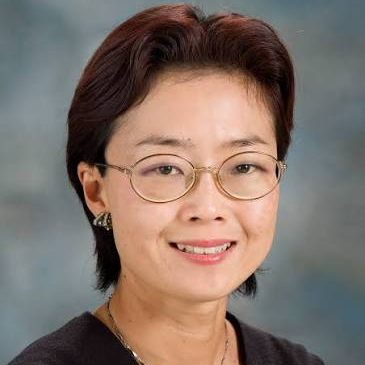{.person-photo}

### Honami Naora

Confirmed speaker

MD Anderson Cancer Center · Department of Molecular Oncology

:::

::: {.person-card}
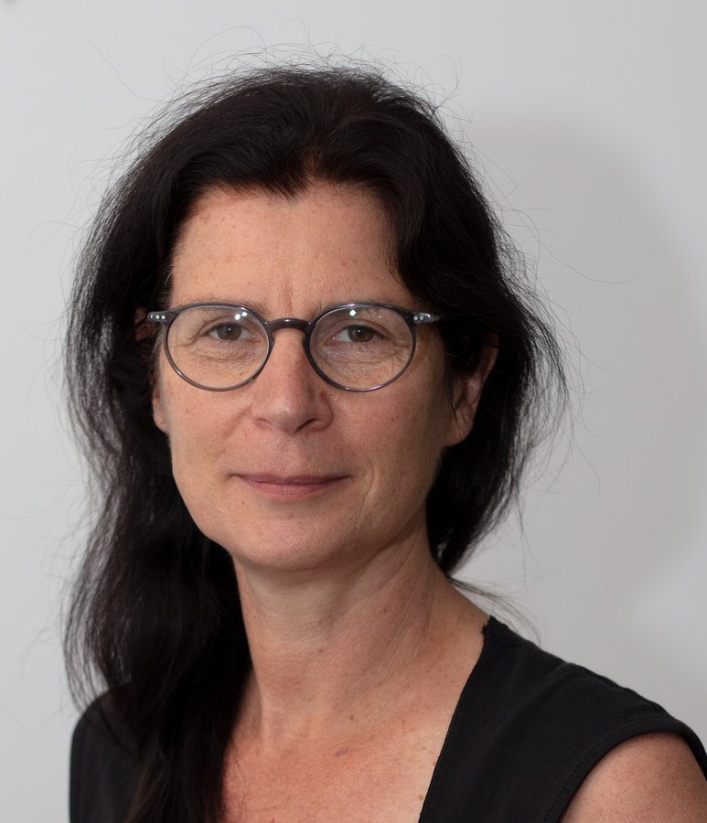{.person-photo}

### Esther Pogatzki-Zahn

Confirmed speaker

University Hospital Münster · Anesthesiology, Intensive Care and Pain Medicine

:::

::: {.person-card}

AR

### Anne Catherine Raby

Confirmed speaker

Cardiff University

:::

::: {.person-card}
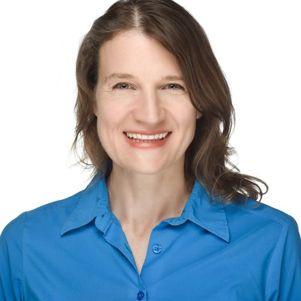{.person-photo}

### Gwendalyn J. Randolph

Confirmed speaker

Washington University in St. Louis

:::

::: {.person-card}
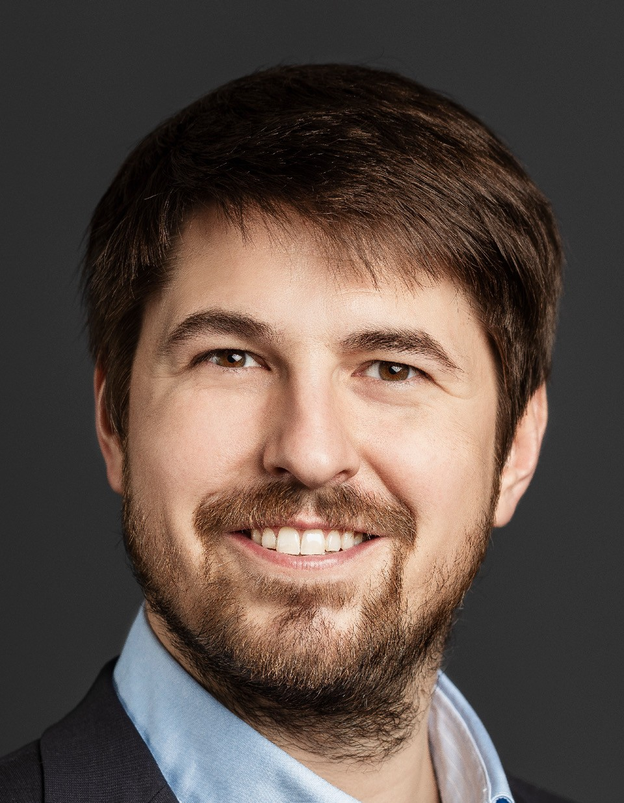{.person-photo}

### Mark Tibbitt

Confirmed speaker

ETH Zürich · Department of Mechanical and Process Engineering

:::

::: {.person-card}
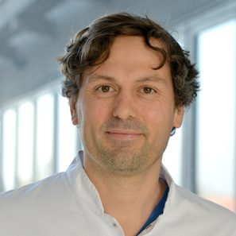{.person-photo}

### Carl Weidinger

Confirmed speaker

Charité — Universitätsmedizin Berlin

:::

::: {.person-card}
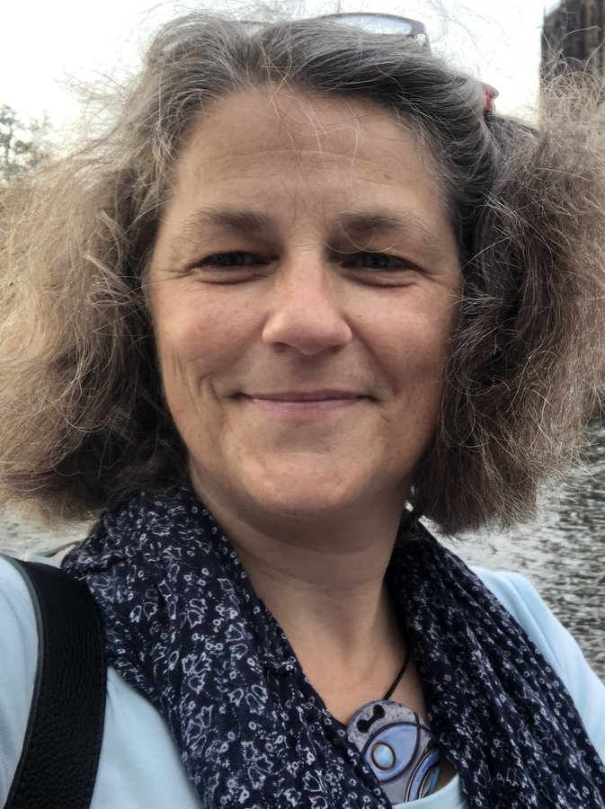{.person-photo}

### Bettina Wilm

Confirmed speaker

University of Liverpool · Institute of Life Course and Medical Sciences

:::

::: {.person-card}
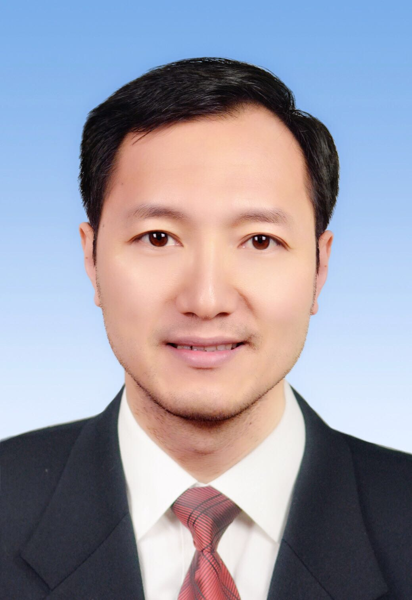{.person-photo}

### Bin Zhou

Confirmed speaker

Chinese Academy of Sciences · Institute of Biochemistry and Cell Biology, Shanghai

:::

:::

More speakers will be added as confirmations come in.

## Organizing committee

::: {.people-grid}

::: {.person-card}
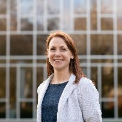{.person-photo}

### Erin Greaves

Co-organizer

Warwick Medical School · Endometriosis

:::

::: {.person-card}
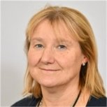{.person-photo}

### Sarah Herrick

Co-organizer

University of Manchester · MMT & Peritoneal Dialysis

:::

::: {.person-card}
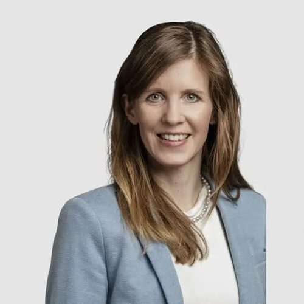{.person-photo}

### Inge K. Herrmann

Co-organizer

ETH Zürich / Empa · Particles–Biology Interactions

:::

::: {.person-card}
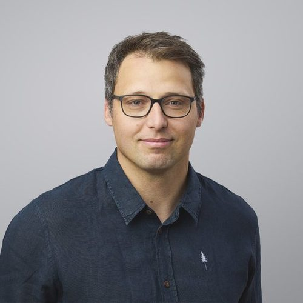{.person-photo}

### Joel Zindel

Co-organizer

ETH Zürich · Institute of Molecular Health Sciences

:::

:::

## Endorsements from the 1st Summit

> *"The programme looks very exciting!"* — Erin Greaves
>
> *"The peritoneal cancer and endometriosis session sounds amazing to me!"* — Nan Zhang
>
> *"While I study peritoneal macrophages, the impact of peritoneal cells could be so broad."* — Paul Kubes
