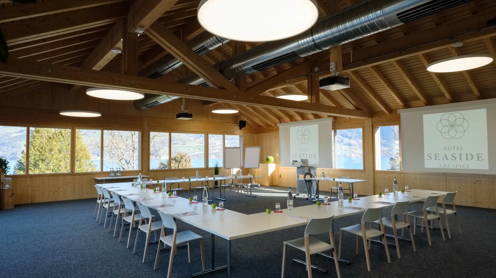
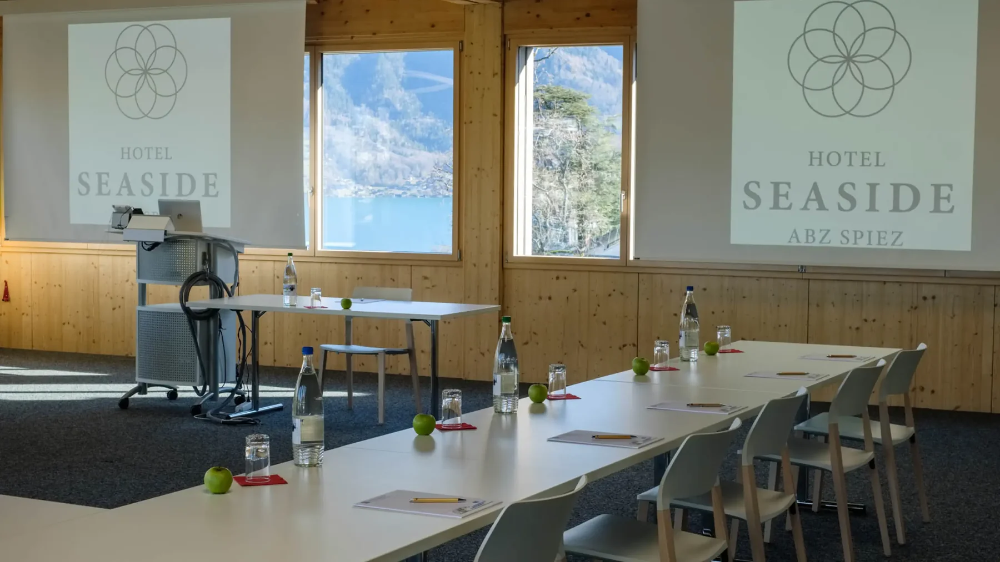
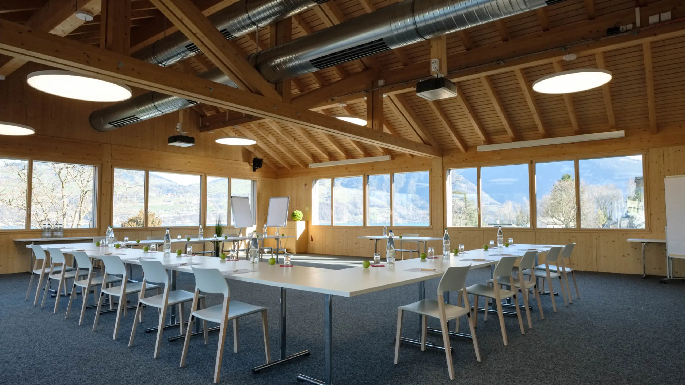
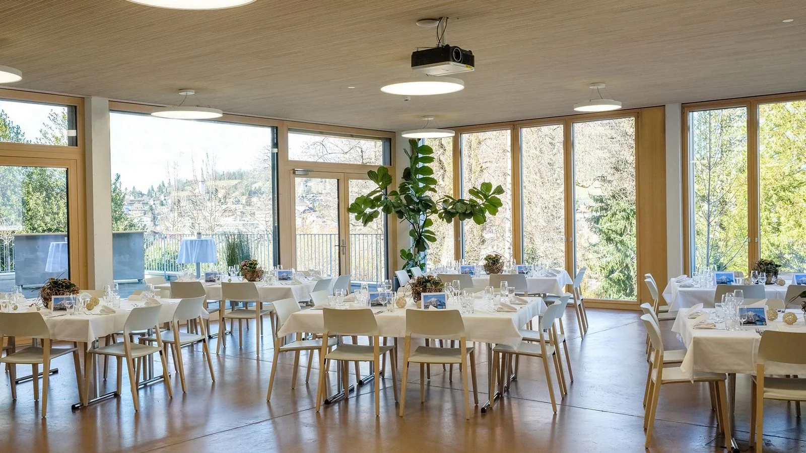
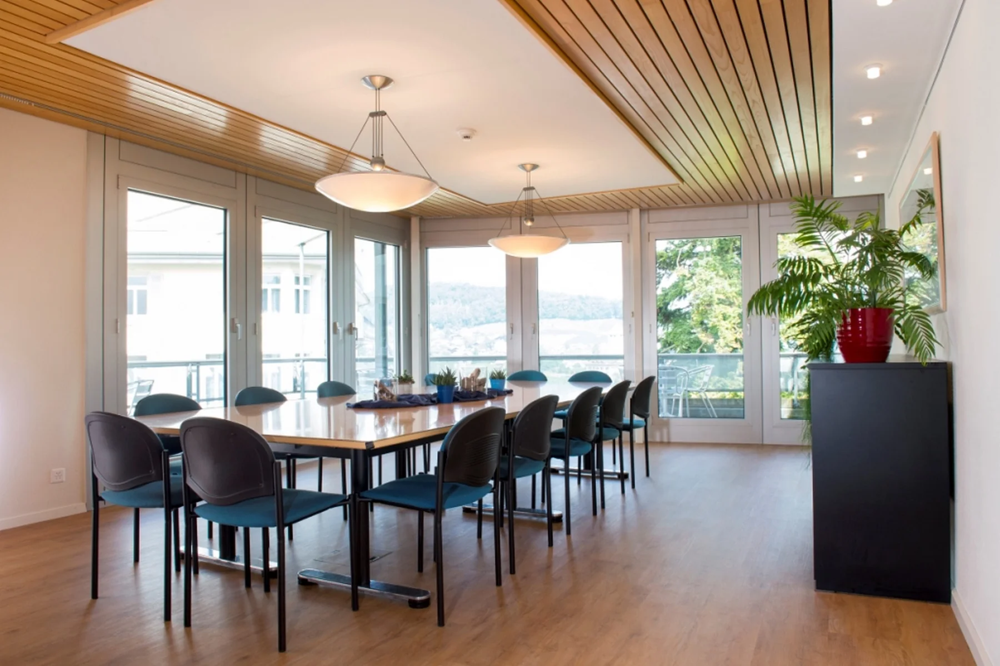
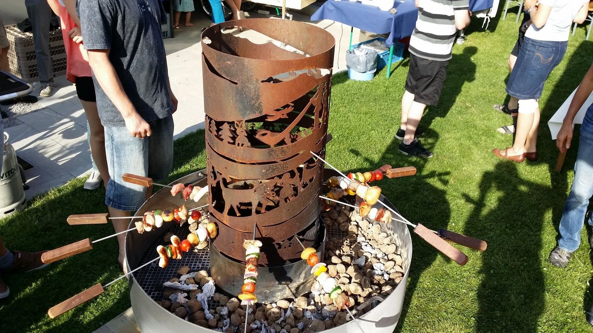
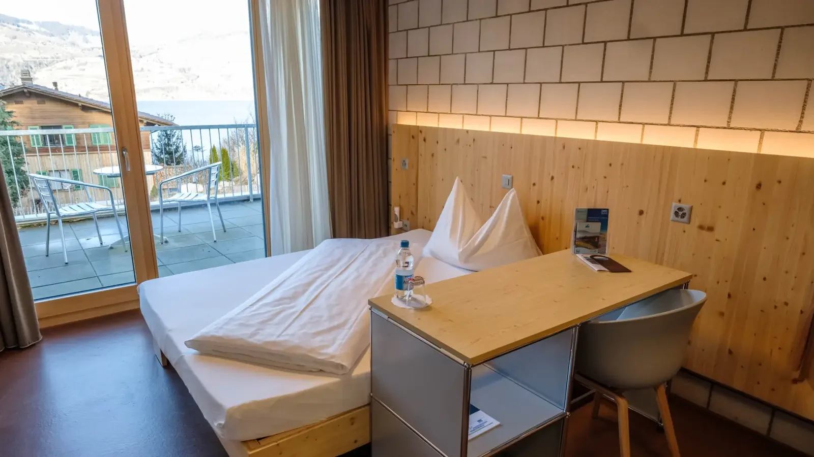
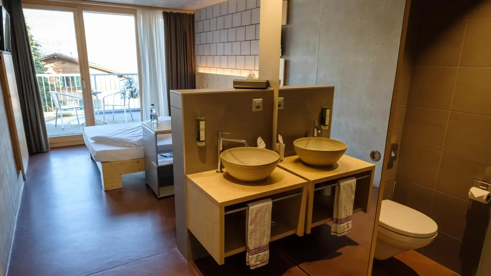

The 2nd Peritoneal Summit takes place at **[Hotel Seaside](https://www.hotel-seaside.ch/)** in **Spiez**, a small town on Lake Thun in the Bernese Oberland, Switzerland.

## Hotel Seaside

Schachenstrasse 43, 3700 Spiez, Switzerland\
[hotel-seaside.ch](https://www.hotel-seaside.ch/)

The hotel sits steps from Lake Thun and offers everything we need in one place: a panoramic plenary hall, a modern seminar room for breakouts and workshops, on-site dining for breaks, lunches, and the networking dinner, and rooms with lake or mountain views. Coffee breaks happen with a view of the alps.

## Plenary and seminar rooms

::: {.grid}

::: {.g-col-12 .g-col-md-6}

:::

::: {.g-col-12 .g-col-md-6}

:::

:::

## Dining and networking

The hotel hosts coffee breaks, lunches, and the networking dinner on-site. The main dining hall opens onto the gardens and lake.

::: {.grid}

::: {.g-col-12 .g-col-md-6}

:::

::: {.g-col-12 .g-col-md-6}

:::

:::

## Accommodation

Conference rates at Hotel Seaside will be available to registered attendees. Booking instructions and the rate code will be posted once registration opens (September 2026). If the on-site block fills, Spiez has several walking-distance hotels and B&Bs we can recommend.

::: {.grid}

::: {.g-col-12 .g-col-md-6}

:::

::: {.g-col-12 .g-col-md-6}

:::

:::

## Getting there

- **By train:** Spiez is on the Bern–Interlaken line. From Zürich Airport about 2 hours; from Bern 25 minutes. The hotel is a short walk from the station.
- **By car:** A8 motorway, well-signposted from Bern.
- **From the airport:** Zürich (~2 h by train) and Geneva (~2.5 h) are both straightforward.

## About Spiez

Spiez sits on the southern shore of Lake Thun. The town is compact and walkable, with views of the surrounding alps and a medieval castle on the lakefront. The Bernese Oberland railways connect to nearby hikes and excursions — Niesen, Stockhorn, Interlaken — for anyone extending their stay.

::: {.callout-tip appearance="simple"}
Images on this page courtesy of Hotel Seaside, used with permission.
:::
