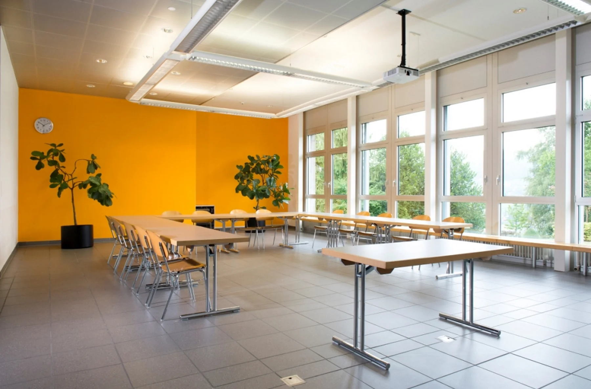

The 2nd Peritoneal Summit takes place at **[Hotel Seaside](https://www.hotel-seaside.ch/)** in **Spiez**, a small town on Lake Thun in the Bernese Oberland, Switzerland.

## Hotel Seaside

Schachenstrasse 43, 3700 Spiez, Switzerland\
[hotel-seaside.ch](https://www.hotel-seaside.ch/)

The hotel sits steps from Lake Thun and offers everything we need in one place: a modern plenary room, breakout spaces, on-site dining, and rooms with lake or mountain views. Coffee breaks happen with a view of the alps.

::: {.grid}

::: {.g-col-12 .g-col-md-6}

:::

::: {.g-col-12 .g-col-md-6}

:::

:::

## Getting there

- **By train:** Spiez is on the Bern–Interlaken line. From Zürich Airport about 2 hours; from Bern 25 minutes. The hotel is a short walk from the station.
- **By car:** A8 motorway, well-signposted from Bern.
- **From the airport:** Zürich (~2 h by train) and Geneva (~2.5 h) are both straightforward.

## Accommodation

Conference rates at Hotel Seaside will be available to registered attendees. Booking instructions and the rate code will be posted once registration opens (September 2026).

If the hotel block fills, Spiez has several other walking-distance hotels and B&Bs we can recommend.

## About Spiez

Spiez sits on the southern shore of Lake Thun. The town is compact and walkable, with views of the surrounding alps and a medieval castle on the lakefront. The Bernese Oberland railways connect to nearby hikes and excursions — Niesen, Stockhorn, Interlaken — for anyone extending their stay.

::: {.callout-tip appearance="simple"}
Images on this page courtesy of Hotel Seaside, used with permission.
:::
